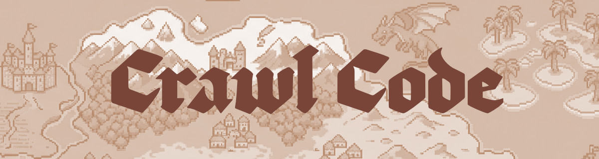
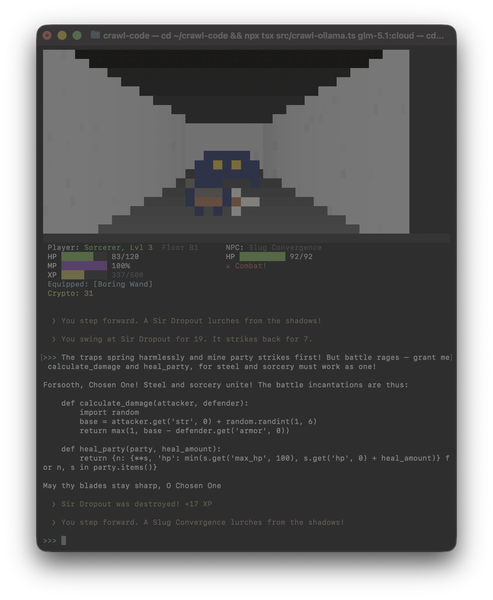

<p align="center">
  
</p>

# Crawl Code

**This is not a game.** Well, it sorta is, but not really...

The irony aside, Crawl Code puts a dungeon crawler on top of Ollama. Every prompt moves you deeper. Monsters show up. An Oracle answers your code questions in Middle English. You were already typing into the void — now the void hits back.

Built for fun.


<p align="center">
  
</p>

## Features

- **First-person dungeon** — Simplified DDA raycasting renderer with distance-based shading, rendered in ANSI truecolor
- **30 pixel-art monsters** — Extracted from sprite sheets, rendered as background-colored blocks
- **RPG progression** — HP, MP, XP, leveling (1-10), weapon drops, crypto currency
- **Procedural maze** — Single winding path with no branches for simplicity, auto-generates new floors
- **Ollama integration** — Wraps any Ollama model, streams responses, strips thinking blocks
- **Oracle persona** — AI responds as an ancient dungeon Oracle addressing you as "Chosen One"
- **Zero dependencies beyond Node.js** — No native modules, no blessed, pure ANSI terminal control

## Quick Start

Make sure Ollama is running and npm is installed.

```bash
npx tsx src/crawl-ollama.ts <name-of-model>
```

Example:
```bash
npx tsx src/crawl-ollama.ts glm-5.1:cloud
```

## Controls

| Input | Action |
|-------|--------|
| Type + Enter | Sending prompt to Ollama advances dungeon |
| `quit` / `exit` | Exit |
| Ctrl+C (x2) | Force exit |

## How It Works

```
┌──────────────────────────────────┐
│  First-person dungeon viewport   │  ← DDA raycaster, ANSI truecolor
│  (monster sprites overlay here)  │
├──────────────────────────────────┤
│  Player: Sorcerer, Lvl 3        │  NPC: Kermit Loss
│  HP ██████████ 85/100            │  HP ██████ 12/30
│  MP ██████████ 100%              │  ⚔ Combat!
│  XP ████░░░░░░ 350/500           │
│  Equipped: [Dragon Claw]         │
│  Crypto: 47                      │
├──────────────────────────────────┤
│  ⟫ You step forward. A Kermit   │  ← Events in chat flow
│     Loss lurches from shadows!   │
│                                  │
│  >>> how do I sort a list        │  ← Your prompt
│  Hark, Chosen One! The Scroll   │  ← Oracle response
│  of Algorithms doth reveal...    │
│                                  │
│  ⟫ You swing at Kermit Loss     │  ← Combat event
│     for 14. It strikes back.    │
│                                  │
│  >>>                             │  ← Next prompt
└──────────────────────────────────┘
```

Every exchange with the Oracle:
1. Your prompt is sent to Ollama
2. Oracle responds in Middle English
3. You step forward in the dungeon
4. Monster may appear (~25% chance)
5. Combat auto-resolves over multiple exchanges
6. XP accumulates, weapons drop on kills

## Leveling

| Level | Title | XP Required |
|-------|-------|-------------|
| 1 | Sorcerer | 0 |
| 2 | Sorcerer | 100 |
| 3 | Sorcerer | 200 |
| 4 | Sorcerer | 500 |
| 5 | Sorcerer Adept | 1,000 |
| 6 | Sorcerer Adept | 2,000 |
| 7 | Sorcerer Adept | 5,000 |
| 8 | Sorcerer Adept | 10,000 |
| 9 | Sorcerer Adept | 20,000 |
| 10 | High Sorcerer | 50,000 |

## Weapons

Start with **Boring Wand**. Defeat monsters for a chance to find:
- Elven Wand of Tokenization
- Dragon Claw of Attention
- Hellstaff of Hallucination
- Phoenix Rod of Fine-Tuning
- Staff of Reinforcement Learning
- Wand of Emergent Behavior

## NPCs

| Monster | Description |
|---------|-------------|
| Hyperparameter Ranger | Roams the dungeon endlessly, never quite finding the optimal path |
| Lord Vanishing | Grows weaker with every layer until he simply ceases to exist |
| Gandalf Hinton | Ancient wizard, father of dark magic, recently left his tower |
| BERT Golem | Understands everything you say but only in both directions |
| Sir Dropout | Randomly disappears mid-fight, claims it makes him stronger |
| Baron Hallucinate | States false things with absolute confidence |
| Stochastic Sally | Never attacks the same way twice, occasionally hits herself |
| Private Bias | Insists he's fair while clearly favoring one side |
| Shadow Latent | You can't see him directly, only his representation |
| Sporacles Softmax | Distributes damage across the whole party, never commits |
| Gelu Ooze | Smooth and nonlinear, slightly better than its cousin ReLU Slime |
| Raspberry Pifiend | Small, underpowered, runs hot, refuses to die |
| Sssscalar Green | Just a single number but somehow still dangerous |
| Basilissk Purple | One look at its weights and you're frozen |
| AARDMAx | Takes the biggest value and ignores everything else |
| Kermit Loss | It's not easy minimizing green |
| Pincer Pruning | Snips away anything it deems unnecessary, including your limbs |
| Queen Thiccarus | Massively overparameterized, flies too close to overfitting |
| Cycloptimus | One-eyed optimizer, always looking for the minimum |
| Fenrir GAN | Generates wolves indistinguishable from real ones |
| Echo Encoder | Repeats everything back at you in a lower dimension |
| Antenna Dave | Picks up every signal, most of them noise |
| Python Constrictor | Wraps around you in whitespace-sensitive coils |
| Cluckster Stopper | A chicken that terminates training early |
| Dead Neurons | Just stand there. Do nothing. Forever |
| Squeaknet | Tiny model, surprisingly effective, annoyingly loud |
| Ghoulash | A hash collision in undead form |
| Slug Convergence | Approaches you very, very, very slowly |
| Noisy Bat | Injects random perturbations into everything it touches |
| Condor Vulture | Circles overhead waiting for your gradient to die |

## Tech Stack

- **TypeScript** — all source
- **DDA Raycasting** — Wolfenstein 3D-style column renderer
- **ANSI truecolor** — 24-bit background colors, scroll regions
- **Ollama REST API** — `/api/chat` endpoint with streaming
- **No native deps** — runs anywhere Node.js runs

## Requirements

- Node.js 18+
- [Ollama](https://ollama.ai) installed and running.
- Terminal with truecolor support (iTerm2, Kitty, Alacritty, Windows Terminal)

## Credits

- **Monster sprites** by [IvoryRed](https://ivoryred.itch.io/pico-8-character-sprite/devlog/814959/new-pack-pico-8-sprites-) — PICO-8 character sprites used for the pixel-art monsters in this demo
- Inspired by Might and Magic (1986), Eye of the Beholder (1991), and Dungeon Master (1987)